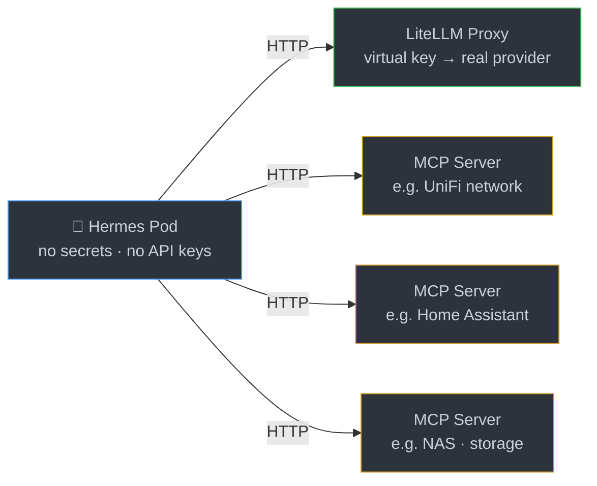

[](https://github.com/geoberle/hermes/actions/workflows/build.yml)
&ensp;
[`ghcr.io/geoberle/hermes`](https://github.com/geoberle/hermes/pkgs/container/hermes)

# homelab-hermes

Your AI-powered homelab administrator — an autonomous agent that can discover, monitor, debug, and manage services on your home network.

## Why

Hermes Agent is a capable autonomous agent with shell access, but out of the box it knows nothing about your homelab. This project turns it into a homelab administrator by:

- **Adding the right tools** — network scanners, security utilities, and debug tools so it can see and interact with your LAN.
- **Keeping it secure** — Hermes holds no secrets and no API keys. LLM access goes through [LiteLLM](https://github.com/BerriAI/litellm) with virtual keys. Homelab service access goes exclusively through MCP servers over HTTP. The MCP servers are the permission boundary — you control what Hermes can do by controlling which MCP servers are reachable.
- **Running on Kubernetes** — a Helm chart deploys it with host-network access and the right Linux capabilities, ready to work.

### Agent profiles

The vision is multiple specialized profiles, each focused on a homelab domain:

| Profile | Status | Description |
|---------|--------|-------------|
| **Network** | Ships today | Host discovery, port scanning, DNS recon, packet capture |
| Security | Planned | Vulnerability scanning, firewall auditing, certificate monitoring |
| Storage | Planned | NAS management, backup verification, disk health |
| Kube debugger | Planned | Pod troubleshooting, resource analysis, log correlation |
| 3D print companion | Planned | Print monitoring, slicer integration, filament tracking |

## How it works

Hermes runs as a non-root user (UID 10000) inside a Kubernetes pod with host-network access. The security model has two layers:

**Architectural** — Hermes never holds real credentials. LLM access goes through a LiteLLM proxy that issues virtual keys, keeping the real provider API keys out of the agent's environment. Homelab service access goes through MCP servers over HTTP. You control what Hermes can do by controlling which MCP servers are reachable and what permissions they expose.

**Container-level** — Network tools that need raw sockets (`nmap`, `arp-scan`, `masscan`, `tcpdump`) have `cap_net_raw` / `cap_net_admin` set as file capabilities, so they work under the non-root user without requiring privileged mode. The Kubernetes `securityContext` adds these capabilities to the container.



## What's included

| Tool | Purpose |
|------|---------|
| `nmap` | Port / host / service / OS scanning |
| `ncat` | Banner grabs, port relays (ships with nmap) |
| `arp-scan` | Fast L2 host discovery |
| `masscan` | High-rate SYN sweeps |
| `tcpdump` | Packet capture / sniffing |
| `iproute2` | `ip` and `ss` for host-network introspection |
| `dnsutils` | `dig`, `nslookup` |
| `iputils-ping` | Reachability testing |
| `traceroute` | Path discovery |
| `jq` | JSON processing |
| `yq` | YAML processing |
| `kubectl` | Kubernetes cluster management |

## Quickstart

**Prerequisites:** a Kubernetes cluster and Helm 3. The chart deploys both Hermes and LiteLLM as a subchart — no separate LiteLLM installation needed.

1. **Configure** — create a local values override with your secrets and LiteLLM model config:

   ```sh
   cat > chart/values.local.yaml <<'EOF'
   secrets:
     TELEGRAM_BOT_TOKEN: "<your-token>"
     GATEWAY_ALLOWED_USERS: "<your-telegram-user-id>"
     LM_API_KEY: "<litellm-virtual-key>"

   litellm:
     masterkey: "<litellm-master-key>"
     proxy_config:
       model_list:
         - model_name: your-model-name
           litellm_params:
             model: provider/model-id
             api_key: os.environ/PROVIDER_API_KEY
     envVars:
       PROVIDER_API_KEY: "<your-provider-api-key>"
       LITELLM_SALT_KEY: "<random-salt>"
   EOF
   ```

2. **Deploy:**

   **From source** (cloned repo):

   ```sh
   helm dependency update ./chart
   helm upgrade --install hermes ./chart \
     -n hermes --create-namespace \
     -f chart/values.local.yaml
   ```

   **From OCI** (published chart):

   ```sh
   helm upgrade --install hermes oci://ghcr.io/geoberle/hermes \
     -n hermes --create-namespace \
     -f values.local.yaml
   ```

3. **Verify** — the agent starts on the dashboard port (default `9119`):

   ```sh
   kubectl -n hermes logs deploy/hermes-agent -f
   ```

## Configuration

These values in `chart/values.yaml` are the ones you'll most likely want to tune:

**Hermes:**

| Value | Default | Description |
|-------|---------|-------------|
| `config.model.default` | — | Model name as registered in LiteLLM |
| `config.model.base_url` | `http://litellm:4000` | LiteLLM proxy endpoint |
| `dashboard.port` | `9119` | Dashboard host port |
| `persistence.size` | `5Gi` | Agent data volume size |
| `persistence.storageClass` | `local-path` | Storage class for the PVC |
| `soul` | `You are Hermes — a helpful agent.` | Agent system prompt |

**LiteLLM** (under the `litellm:` key):

| Value | Default | Description |
|-------|---------|-------------|
| `litellm.masterkey` | — | Master API key for the LiteLLM proxy |
| `litellm.proxy_config.model_list` | — | Models to expose through the proxy |
| `litellm.envVars.PROVIDER_API_KEY` | — | Real API key for your LLM provider |
| `litellm.envVars.LITELLM_SALT_KEY` | — | Salt for LiteLLM's key hashing |

See [`chart/values.yaml`](chart/values.yaml) for all options.

## Development

### Building the image

```sh
docker build -t ghcr.io/geoberle/hermes:latest .
docker push ghcr.io/geoberle/hermes:latest
```

### Bumping upstream

Update the `FROM` digest at the top of `Dockerfile` and rebuild. The pinned digest is intentional — `:main` floats.

### CI

GitHub Actions builds and pushes on every push to `main` that touches the `Dockerfile`, `chart/`, or the workflow itself. It also runs a weekly rebuild (Mondays 04:17 UTC) to keep apt-installed tools fresh. The workflow:

1. Builds a multi-arch image (`amd64` + `arm64`)
2. Pushes to GHCR with `latest`, `sha-<commit>`, and date tags
3. Packages and pushes the Helm chart to `oci://ghcr.io/geoberle`
